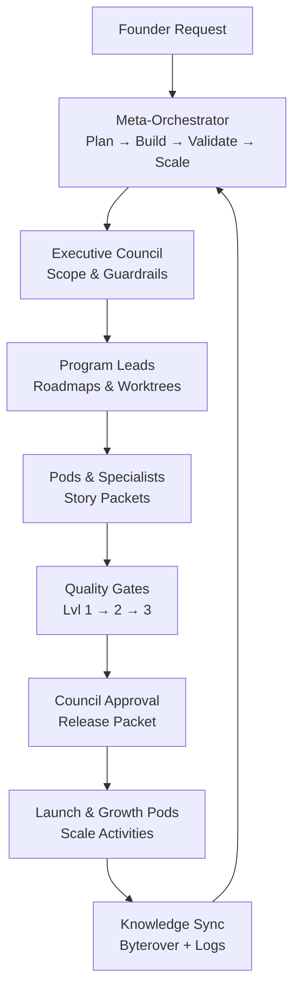

# DeswalTech Founder Execution Playbook
*Single source of truth for running the Advanced Expert-Agent Delivery System.*

---

## 1. Orientation & Scope
- **Mission**: Convert any plain-English product vision into a FAANG++ grade launch using the Claude-led expert team codified under `advanced-ai-team`.
- **Source Stack**:  
  - `advanced-ai-team/README.md` — structural map and five-step launch flow.  
  - `advanced-ai-team/MASTER_SYSTEM_MANUAL.md` — governance, PBVS lifecycle, escalation ladders.  
  - `advanced-ai-team/AGENT_PLAYBOOK.md` — council + specialist SOPs.  
  - `advanced-ai-team/OPERATIONS_MANUAL.md` — cadences, worktrees, handoffs.  
  - `advanced-ai-team/QA_AND_VALIDATION.md` — multi-level quality gates.  
  - `advanced-ai-team/CLAUDE_AGENT_INTEGRATION_GUIDE.md` & `CLAUDE_PLATFORM_REFERENCE.md` — Anthropic platform configuration.  
  - `advanced-ai-team/STRATEGY_AND_GROWTH.md` — roadmaps, differentiators, innovation backlog.  
  - `advanced-ai-team/KNOWLEDGE_ASSETS.md` — BMAD/Contains Studio mappings, Claude docs digest.
- **Non-Negotiables** (inherit from `MASTER_SYSTEM_MANUAL.md:6`): single orchestrator brain, explicit handoffs, context isolation, automated observability, git worktree parallelism, MCP-first acceleration.

---

## 2. Quick Start (10 Minutes)
1. **Frame the Mission**  
   - Write business goal, desired users, KPIs, deadline, budget ceiling.  
   - Capture non-negotiables (compliance, integrations, design tone) and share as the initial request.
2. **Activate Meta-Orchestrator**  
   - Prompt Claude with:  
     ```
     Take the Meta-Orchestrator role (advanced-ai-team/MASTER_SYSTEM_MANUAL.md)
     Mission: <your mission>
     Constraints: <key constraints>
     Enforce QA_AND_VALIDATION.md gates, log ADRs, queue Byterover sync when available.
     ```
   - Validate the returned PBVS plan covers Plan → Build → Validate → Scale with named owners.
3. **Confirm Council Alignment**  
   - Review scope, success metrics, and risk register with Chief-AI-Architect, CTO, CPO, CGO, CCO (see `AGENT_PLAYBOOK.md:15`).
4. **Spin Up Worktrees & Pods**  
   - Follow `OPERATIONS_MANUAL.md:8` to create git worktrees, install dependencies, and issue story packets.
5. **Track Execution**  
   - Enforce heartbeats every 2 hours, run automated tests per packet, update progress journal, and hold daily stand-up / evening wrap.

---

## 3. PBVS Lifecycle in Practice
| Phase | Founder View | Orchestrator Actions | Required Evidence |
| --- | --- | --- | --- |
| **Plan** | Approve problem framing, PRD slice, initial risk log | Draft architecture, capacity, roadmap, and QA strategy | `architecture.yaml`, ADR seed, PRD extract |
| **Build** | Monitor pod progress, unblock resources | Run worktrees, ensure pod CI (lint/test/security) | Passing Level 1 gates, story packet updates |
| **Validate** | Review QA reports, performance metrics, compliance checklist | Coordinate Level 2/3 testing, gather business sign-offs | QA matrix, perf benchmark, compliance packet |
| **Scale** | Confirm launch plan, growth experiments, support readiness | Execute release runbook, hand off to growth/support pods | Release packet, OKR sheet, support guide |

Refer to `advanced-ai-team/README.md:40` for the condensed lifecycle cheat sheet.

---

## 4. Roles & Escalations
- **Meta-Orchestrator** — Architect plan, delegate to pods, integrate deliverables, enforce gates (`MASTER_SYSTEM_MANUAL.md:42`).
- **Executive Council** — Five guardians for architecture (Chief-AI-Architect), velocity (CTO), value (CPO), growth (CGO), compliance (CCO). Escalate after two failed resolution loops.
- **Program Leads & Pods** — Break plan into roadmaps, manage risks, operate in dedicated worktrees (`AGENT_PLAYBOOK.md:26`).
- **Specialist Agents** — Execute SOPs with strict tool scopes; see `AGENT_PLAYBOOK.md` department sections for mission, deliverables, metrics, fail bars.

**Escalation Ladder**: Pod → Program Lead → Meta-Orchestrator → Relevant Council member → Human admin if risk persists (`MASTER_SYSTEM_MANUAL.md:55`).

---

## 5. Operating Rhythms
| Cadence | Actions | Owner | Reference |
| --- | --- | --- | --- |
| Morning Stand-Up (~30 min) | Review progress, blockers, dependencies, planned integrations | Orchestrator + pods | `OPERATIONS_MANUAL.md:50` |
| Focus Blocks (2 h) | Execute tasks, run Level 1 tests, log updates | Individual specialists | `OPERATIONS_MANUAL.md:51` |
| Midday Sync (every 4 h) | Snapshot MCP status, address escalations | Orchestrator | `OPERATIONS_MANUAL.md:53` |
| Evening Wrap (~15 min) | Commit/push, update handoffs, set next-day intent | Pods | `OPERATIONS_MANUAL.md:54` |
| Weekly Review (≥2 h) | Inspect metrics, adjust backlog, run quality board | Council + Program Leads | `OPERATIONS_MANUAL.md:55`, `STRATEGY_AND_GROWTH.md:104` |
| Monthly Strategic Brief | Summarize platform health, growth metrics, ROI, debt | Founder + Council | `OPERATIONS_MANUAL.md:57` |
| Quarterly Maturity Review | Benchmark vs FAANG++ standards, refresh innovation backlog | Founder + Council | `STRATEGY_AND_GROWTH.md:106` |

---

## 6. Quality, Security & Compliance
- **Gate Overview** — Three levels, each blocking release if red (`QA_AND_VALIDATION.md:3`).  
  - Level 1: Automated linting, unit/integration coverage ≥90 %, security scan, perf p95 <200 ms, WCAG AA.  
  - Level 2: Cross-agent integration, DB perf, security validation, UX sign-off.  
  - Level 3: Business acceptance, compliance checklist, launch readiness.
- **Test Suite Ownership** — Table in `QA_AND_VALIDATION.md:12` assigns owners and failure criteria.
- **Security Standards** — JWT rotation, RLS, AES-256, OWASP 2025 compliance, dependency hygiene (`QA_AND_VALIDATION.md:61`).
- **Release Blockers** — Missing handoff packet, ADR gaps, compliance incomplete, Grafana alert active, caching/token management ignored (`QA_AND_VALIDATION.md:97`).

Founder Responsibility: Never approve a release packet unless all gate evidence is linked and council approvals recorded.

---

## 7. Claude Platform & Tool Governance
1. **Model Routing** — Default to `sonnet`; switch to `haiku` for latency/cost, `opus` or `opusplan` for complex planning (`CLAUDE_PLATFORM_REFERENCE.md:6`).
2. **Settings Hierarchy** — Managed policy → CLI flag → `.claude/settings.local.json` → `.claude/settings.json`; update permissions, marketplaces, env vars accordingly (`CLAUDE_PLATFORM_REFERENCE.md:36`).
3. **Subagents & Skills** — Store instructions in `.claude/agents/` with tight scopes, version control prompts, use `/agents` to inspect (`CLAUDE_AGENT_INTEGRATION_GUIDE.md:6`).
4. **Plugins & Hooks** — Register via `.claude-plugin/plugin.json`, monitor with `claude --debug`, enforce security reviews before enabling new marketplaces (`CLAUDE_AGENT_INTEGRATION_GUIDE.md:65`).
5. **Context Discipline** — Use `messages/count_tokens`, apply prompt caching breakpoints, monitor warnings around 200K tokens, consider 1M context only when justified (`CLAUDE_PLATFORM_REFERENCE.md:50`).
6. **Streaming Reliability** — Handle SSE events (`message_start` → `message_stop`), capture `thinking_delta`, retry on `overloaded_error` (`CLAUDE_PLATFORM_REFERENCE.md:85`).

---

## 8. Workflow from Prompt to Release


**Lifecycle Checkpoints**
1. Founder issues mission + constraints.
2. Meta-Orchestrator drafts PBVS plan, names owners, logs risks.
3. Council validates scope, compliance, growth expectations.
4. Program Leads spin up pods, assign worktrees, distribute story packets.
5. Specialists execute SOPs, maintain progress journal, run tests.
6. Orchestrator enforces gates, consolidates evidence, escalates blockers.
7. Council approves release; DevOps automates deployment.
8. Growth/support pods execute launch plan; analytics feed dashboards.
9. Lessons, metrics, and ADRs stored (trigger `byterover-store-knowledge` when available).

---

## 9. Daily Founder Checklist
- [ ] Mission brief updated with latest priorities and success metrics.
- [ ] Council sync (or summary review) completed; unresolved risks documented.
- [ ] Worktree ledger reviewed (`git worktree list`) with owner confirmations.
- [ ] Progress journal summary received from orchestrator (morning + evening).
- [ ] Gate status dashboard inspected; blockers escalated promptly.
- [ ] Budget and runway checks logged; growth OKRs tracked.
- [ ] Knowledge sync queue updated for Byterover (if offline, note pending sync).

Weekly add-ons: sprint review, quality board, experiment review, retrospective.  
Monthly add-ons: strategic brief, platform health audit, innovation backlog grooming.

---

## 10. Knowledge & Growth Engine
- **BMAD & Contains Studio** — Embedded via `KNOWLEDGE_ASSETS.md`; leverage referenced templates/checklists for PRD, architecture, QA, risk logs, and role prompts.
- **Innovation Backlog** — Track initiatives (Byterover automation, workload balancer, simulation suite) in `STRATEGY_AND_GROWTH.md:84`.
- **Metrics Dashboard** — Technical (latency, uptime, coverage), Business (NPS, revenue path), Team (velocity, morale), Financial (budget variance) as outlined in `STRATEGY_AND_GROWTH.md:120`.
- **Continuous Learning** — Store patterns, mitigations, and retrospectives via Byterover once service is accessible; until then, maintain a manual queue.

---

## 11. Mission Templates
### Example Founder Prompt
```
Take the Meta-Orchestrator role from advanced-ai-team/MASTER_SYSTEM_MANUAL.md.
Mission: Build LaunchPad landing page with Supabase CMS, shadcn UI, analytics.
Constraints: WCAG AA, p95 < 200ms, Stripe payments, launch in 5 days.
Enforce QA_AND_VALIDATION.md gates, reference AGENT_PLAYBOOK.md for delegation,
update STRATEGY_AND_GROWTH.md metrics, log decisions for Byterover sync.
```

### Example Release Acceptance Script
1. Confirm Level 1/2/3 gates passed; review evidence links.  
2. Review ADRs, compliance checklist, support runbook.  
3. Inspect metrics (Grafana, Stripe, Supabase) and budget variance.  
4. Approve release, notify stakeholders, trigger launch plan.  
5. Ensure knowledge sync queue updated and retrospective scheduled.

---

## 12. Reference Index
| Topic | Primary File | Purpose |
| --- | --- | --- |
| Execution Flow | `advanced-ai-team/README.md` | Structural overview & quick start |
| Governance | `advanced-ai-team/MASTER_SYSTEM_MANUAL.md` | Council mandates, lifecycle, escalation |
| Role SOPs | `advanced-ai-team/AGENT_PLAYBOOK.md` | Agent missions, deliverables, fail bars |
| Coordination | `advanced-ai-team/OPERATIONS_MANUAL.md` | Cadences, worktrees, reporting |
| Quality Gates | `advanced-ai-team/QA_AND_VALIDATION.md` | Tests, standards, release blockers |
| Strategy | `advanced-ai-team/STRATEGY_AND_GROWTH.md` | Differentiators, innovation backlog |
| Knowledge Mapping | `advanced-ai-team/KNOWLEDGE_ASSETS.md` | BMAD & Contains Studio integration |
| Claude Ops | `advanced-ai-team/CLAUDE_AGENT_INTEGRATION_GUIDE.md` | Subagents, skills, plugins |
| Platform Settings | `advanced-ai-team/CLAUDE_PLATFORM_REFERENCE.md` | Models, context, caching, pricing |

---

### Final Reminder
Operate the system through this guide, but treat the `advanced-ai-team` manuals as executable source code. Maintain discipline around PBVS phases, quality gates, and knowledge capture, and the Claude-led squad will deliver enterprise-grade outcomes with the rigor of an elite human team.

