# 🚀 DeswalTech v4.0 (Codename: Nexus)
**The Ultimate AI Agent Team System - Perfection Merge Edition**

**Status**: ✅ Active & Production-Ready
**Date**: October 28, 2025

---

## 1. Executive Summary

This repository contains the **Nexus AI Team**, a clean, stable, and production-ready system for building full-stack applications using a team of coordinated AI agents.

It is the result of a "Perfection Merge" between two powerful concepts:
*   **DeswalTech (The "Brain"):** 7,772+ lines of ultra-deep, 2025-spec domain expertise across 7 critical software engineering domains.
*   **Nexus AI (The "Nervous System"):** A modern, precision-workflow architecture featuring Subagents, Agent Skills, and a non-negotiable **"wait-for-yes" execution protocol** that ensures human oversight.

The result is a team of expert agents that possess both **unmatched depth** and **unwavering discipline**.

**Final Audit Verdict**: ✅ **APPROVED FOR PRODUCTION USE**

---

## 2. System Strengths: The Best of Both Worlds

The Nexus AI team possesses:

### From DeswalTech (The "Brain"):
- ✅ **Ultra-Deep Domain Expertise**: 7,772 lines of knowledge integrated.
- ✅ **Latest 2025 Tech Stacks**: Argon2id, React 19, Next.js 15, K8s 1.29+, PostgreSQL 16+.
- ✅ **PBVS Lifecycle**: A proven Plan → Build → Validate → Scale project lifecycle.
- ✅ **3-Level Quality Gates**: Enforcing automated, integration, and business quality checks.
- ✅ **Real Code Patterns**: 50+ patterns for advanced security, caching, and performance.

### From Nexus AI (The "Nervous System"):
- ✅ **Subagent Architecture**: Isolated contexts for each agent to prevent errors.
- ✅ **Agent Skills**: Reusable, structured workflows for common tasks (e.g., creating PRDs, parsing tasks).
- ✅ **Task-Executor Protocol**: A non-negotiable "wait-for-yes" loop that ensures you have full control.
- ✅ **RPG-Structured PRDs**: Automatic dependency tracking and task ordering.
- ✅ **Precise Handoffs**: Explicit control transfer between agents.

---

## 3. Quick Start: Installation & First Project

The operational system is a Claude Code plugin named `nexus-ai-team`.

### Step 1: Add Local Marketplace to Claude Code

Open Claude Code and run this command in the chat:

```
/plugin marketplace add /Users/pratikdeswal/Projects/DeswalTech/Nexus Ai/local-marketplace
```

### Step 2: Install the Nexus AI Team Plugin

After adding the marketplace, run:

```
/plugin install nexus-ai-team@local-nexus-marketplace
```

### Step 3: Restart Claude Code

Close and restart your editor to activate the plugin.

### Step 4: Verify Installation

After restarting, run `/plugin list`. You should see `nexus-ai-team@local-nexus-marketplace` as installed.

### Step 5: Start Your First Project!

Always start by invoking the **Supervisor**. Provide a high-level goal. For example:

```
/agent supervisor

Build a Hello World API:
- Single GET endpoint at /api/hello that returns {"message": "Hello World"}
- Unit test for the endpoint
- Dockerfile for deployment

Timeline: 30 minutes
Quality: Production-ready
```

---

## 🚀 Achieving Maximum Potential with DeswalTech

DeswalTech is more than just a collection of agents; it's a sophisticated, multi-agent system designed to deliver enterprise-grade software with precision and control. To unlock its full potential, it's crucial to embrace its core workflow and understand your role as the project administrator.

### The Philosophy: You are the Architect, the Supervisor is your Foreman

Think of yourself as the architect and CEO of your project. You provide the vision, set the strategic direction, and make the final decisions. The `supervisor` agent is your expert foreman, responsible for translating your vision into a concrete plan and managing the team of specialist agents to execute it flawlessly.

Your goal is not to micromanage the agents, but to provide clear, high-level direction and to act as the final approver at critical checkpoints.

### Phase 1: The Vision - Strategic Planning with the Supervisor

This is the most important phase. A well-defined plan is the foundation for a successful project.

1.  **Start with a Clear Goal:** When you invoke the `supervisor`, don't just give it a vague idea. Provide a clear, concise summary of what you want to build. The more specific you are, the better the `supervisor` can understand your vision.

2.  **Embrace the Socratic Dialogue:** The `supervisor` will ask you clarifying questions. This is not a sign of weakness, but a crucial part of the process. Your answers will shape the project's requirements and ensure that the final product meets your expectations.

3.  **The PRD is Your Contract:** The Product Requirements Document (PRD) is the single source of truth for the project. Review it carefully before approving it. A well-defined PRD will prevent misunderstandings and ensure that the agents build the right thing.

### Phase 2: The Blueprint - From Vision to Actionable Tasks

Once the PRD is approved, the `supervisor` will create a detailed `TASKS.md` file. This is where the magic happens.

*   **Trust the Process:** The `supervisor` uses a sophisticated dependency-aware algorithm to break down the PRD into a series of actionable tasks, ordered for maximum efficiency. You don't need to worry about the order of execution; the `supervisor` has it covered.

*   **Review the Plan:** While you don't need to micromanage, it's a good idea to review the `TASKS.md` file to get a high-level understanding of the execution plan.

### Phase 3: The Assembly Line - Flawless Execution

This is where the specialist agents shine. The `supervisor` will delegate each task to the most appropriate agent.

*   **The "One Sub-Task at a Time" Protocol:** This is the core of DeswalTech's safety and control mechanism. Each agent will complete a small, incremental sub-task and then **stop and wait for your approval**. This gives you complete control over the development process.

*   **Your Role: The Approver:** Your primary role during this phase is to review the agent's work and provide a simple "yes" or "no". A quick "yes" keeps the assembly line moving. A "no" allows you to provide feedback and course-correct early.

*   **Leverage the Power of MCPs:** When providing the initial requirements, think about what external services you need. If you need to process payments, mention Stripe. If you want to deploy to Vercel, say so. The `supervisor` will instruct the specialist agents to use the available Model Context Protocol (MCP) servers, ensuring that your project is built with the latest industry-standard tools.

### Phase 4 & 5: The Launch - Quality and Deployment

DeswalTech is designed to produce production-ready software.

*   **Trust the Quality Gates:** The system has a rigorous, 3-level quality gate process. You can be confident that the code produced by the agents is of high quality.

*   **Automated Deployment:** The `devops` agent will handle the complexities of deployment, whether you're using Docker, Kubernetes, or a platform like Vercel.

### The Golden Rule: High-Level Vision, Low-Level Trust

To achieve maximum potential with DeswalTech, remember this golden rule:

> **Provide a clear, high-level vision to the `supervisor`, and then trust the system to handle the low-level details.**

Your power lies not in writing code, but in making strategic decisions and providing clear feedback. Embrace your role as the architect, and let your expert AI team handle the rest.

---

## 4. The Core Workflow

The system follows a strict, automated workflow that gives you full visibility and control.

```mermaid
graph TD
    A[User: /agent supervisor] --> B[Supervisor Agent]
    B --> C{Phase 1: PLAN}
    C --> D[workflow/prd-creator skill]
    D --> E[RPG-Structured PRD created]
    E --> F{Phase 2: PARSE}
    F --> G[workflow/task-parser skill]
    G --> H[TASKS.md generated with dependencies]
    H --> I{Phase 3: BUILD}
    I --> J[core/delegator skill]
    J --> K{Select Best Specialist}
    K --> L[backend, frontend, etc.]
    L --> M[workflow/task-executor skill]
    M --> N[Implement ONE task]
    N --> O[STOP - Ask for approval]
    O --> P{User replies 'yes'?}
    P -->|Yes| Q[Commit changes & hand back]
    P -->|No| N
    Q --> B
    B --> R{More tasks?}
    R -->|Yes| I
    R -->|No| S{Phase 4 & 5: VALIDATE & SCALE}
    S --> T[✅ COMPLETE]
```



**The "Wait for Yes" Protocol is CRITICAL**: Every agent will complete ONE task, then STOP and ask for your approval. This gives you precise control over every step.

---

## 5. The Nexus AI Team (7 Expert Agents)

**⭐ IMPORTANT**: Always start with `/agent supervisor`. The Supervisor will delegate to other agents automatically.

| Agent | Invoke With | Use For |
|---|---|---|
| 🎯 **Supervisor** | `/agent supervisor` | ⭐ **START HERE** - Project management, orchestration |
| 🏗️ **Architect** | `/agent architect` | Database schema, system design, API contracts |
| 🔧 **Backend** | `/agent backend` | APIs, databases, authentication, business logic |
| 🎨 **Frontend** | `/agent frontend` | Web UI, React components, styling |
| 🧪 **QA Tester** | `/agent qa-tester` | Unit, integration, E2E, and load testing |
| 🐳 **DevOps** | `/agent devops` | Docker, Kubernetes, CI/CD, and deployment |
| 🔐 **Security** | `/agent security` | Security audits, OWASP compliance, vulnerability scanning |

---

## 6. Technology Stack (2025 Latest)

This system builds with a modern, enterprise-grade technology stack.

### Backend
- **Runtime**: Node.js 20 LTS
- **Language**: TypeScript 5.3+ (strict mode)
- **Framework**: Fastify 4.x | NestJS 10.x
- **Database**: PostgreSQL 16+
- **Password**: **Argon2id** (replaces bcrypt)

### Frontend
- **Framework**: Next.js 15+ (App Router)
- **React**: React 19+ (Server Components)
- **Styling**: TailwindCSS 4+ + shadcn/ui

### DevOps & Security
- **Container**: Docker 25+, Kubernetes 1.29+
- **CI/CD**: GitHub Actions, ArgoCD (GitOps)
- **Security**: OWASP Top 10 2025, NIST SSDF, Trivy, Falco

---

## 7. Quality Gates Framework

The system enforces a 3-level quality gate process to ensure production-readiness.

- **Level 1: Automated (Real-time)**: Enforced by the CI/CD pipeline on every commit. Includes code quality checks, >90% test coverage, security scans, and performance budgets.
- **Level 2: Integration (Daily)**: Verified by the AI team. Includes end-to-end workflow testing, API contract validation, and cross-component integration checks.
- **Level 3: Business (Weekly/Pre-Launch)**: Validated by the human user and the Supervisor. Includes feature completeness, user experience validation, and stakeholder approval.

---

## 8. Performance Targets

| Metric | Target | Validation Method |
|---|---|---|
| API Response (p95) | <100ms | k6 load testing |
| Database Query (p95) | <50ms | Query profiling |
| Page Load (LCP) | <2.5s | Lighthouse |
| Lighthouse Score | >95 all categories | CI/CD pipeline |
| Uptime SLA | 99.9% | Prometheus monitoring |

---

## 9. Security Standards

Security is built-in and non-negotiable, following the latest 2025 standards.

- **Frameworks**: OWASP Top 10 2025, NIST SSDF.
- **Authentication**: JWTs with 15-minute access tokens and 7-day refresh tokens.
- **Password Hashing**: **Argon2id** is used instead of bcrypt.
- **Encryption**: AES-256-GCM for data at rest, TLS 1.3 for data in transit.
- **Authorization**: Role-Based Access Control (RBAC) and Row-Level Security (RLS) in PostgreSQL.

---

## 10. MCP (Model Context Protocol) Services

The agents can leverage over 20 external tools and services. To use them, simply mention them in your requirements (e.g., "Deploy to Vercel" or "Add a shadcn button"). The table below lists some of the key services available.

| Service | Category | Use For |
|---|---|---|
| **Figma** | Design & UI | Syncing designs and components |
| **shadcn** | Design & UI | High-quality React components |
| **Expo** | Mobile Dev | Building React Native apps |
| **Playwright** | Web & Testing | Browser automation and E2E testing |
| **Vercel** | Deployment | Deploying frontend projects |
| **GitHub** | Deployment | Managing repos, issues, and PRs |
| **Stripe** | Payments | Processing payments and subscriptions |
| **Supabase** | Database | PostgreSQL database, auth, and real-time data |
| **Semgrep** | Code Quality | Static code analysis for bugs and vulnerabilities |
| **Linear** | Project Mgmt | Managing tasks and tracking sprints |

*Note: Some services require API keys to be set in the `mcp.json` file.*

---

## 11. Repository Structure

```
DeswalTech/
├── 📖 README.md                          (This file - start here)
│
├── 🚀 Nexus Ai/                          ⭐ THE OPERATIONAL SYSTEM
│   ├── nexus-ai-team/                    (7 agents + 5 skills)
│   │   ├── agents/                       (supervisor, backend, etc.)
│   │   └── skills/                       (prd-creator, task-parser, etc.)
│   └── local-marketplace/                (Plugin marketplace config)
│
├── 📁 .archive/                          (Archived legacy files)
│
├── 🔧 Infrastructure/                    (Local dev infrastructure)
│
├── 🛠️ mcp-server/                        (MCP server implementation)
│
├── 📜 scripts/                           (Utility scripts)
│
├── 📋 PROJECT_CONTEXT_TEMPLATE.md         (Template for new projects)
│
├── 📄 LICENSE                            (Project License)
│
├── 📄 mcp.json                           (MCP server configurations)
│
├── 📄 package.json                        (Project dependencies)
│
└── 📄 .gitignore                         (Git ignore file)
```

---

## 13. License

This project is licensed under the MIT License. See the `LICENSE` file for details.